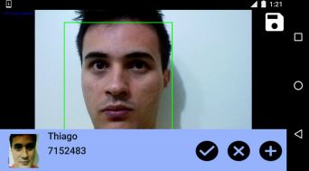

# Student Control

This project presents the development of a biometric recognition system applied to students attendance track. 

The objective was to develop an application for Android devices that enables teachers to track students attendance through face recognition and generate a report on the track.

Please check the complete project (in Portuguese) where it is explained all the choices and references in this [paper](http://www.tcc.sc.usp.br/tce/disponiveis/18/180450/tce-11012017-172542/?&lang=br).

## Prerequisites
- Android Studio
- Android version 4.4 (KitKat)
- openCV
- SQLite

## Solution

### Pre-Processing
- Pre-processing: convert to gray scale
- Histogram equalization (to avoid sensitivity to illumination variance).
- Resizing of the captured face

### Data sotrage
- Local SQLite database (both the model and the data)

### Algorithm
- LBP operator (Robust to pose and light variations)
- Adaboost

### Example of use

## Results
We tested the project with the [Essex Faces 94 database](https://cswww.essex.ac.uk/mv/allfaces/faces94.html), a database with 20 images from 153 subjects,
varying background, pose, illumination, and distance to the camera.

We evaluated both the face detection (ability to detect the face in a given image) as the face recognition (ability to identify the identity of the subject in a given image)

- Face Detection: **98,75%** accuracy.
- Face Recognition: **96,26%** accuracy.